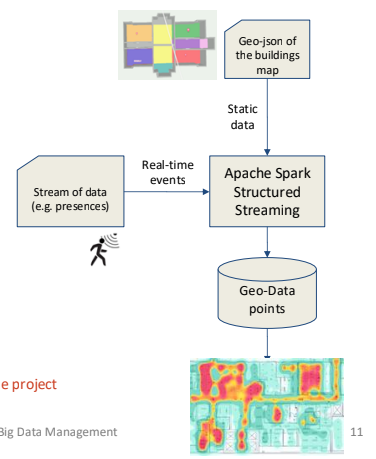

# Heat-map analytics

The project is about developing an analytics pipeline to generate geo-located
heat maps from time-series IoT data.

## Problem Statement

The time series contains temporal
information about IoT data events observed
over time. The geolocation information of
the source device is outside of this stream.

## Project Proposal

The aim is to develop an analytical pipeline
to match time series with geo-location
information and perform aggregation overt
time windows. The final result is the
development of a geo-heat map visualization
tool.



## Project Requisites and Environment Setup

This project uses [Conda](https://docs.conda.io/en/latest/) to manage its dependencies and ensure a consistent
development environment across different machines.

### JDK 17 Installation

Since the analytics in this project rely on Java-based components, a Java Development Kit (JDK) version 17 or later is
required. Here’s how you can install it:

1. Visit the official website of your preferred JDK distributor. For instance, you can use:
    - [Oracle JDK 17 Downloads](https://www.oracle.com/java/technologies/javase/jdk17-archive-downloads.html)
2. Download the installer for your operating system and follow the provided steps to complete the installation.
3. Once installed, verify your Java installation by running:
   ```bash
   java --version
   ```
4. Ensure that the `JAVA_HOME` environment variable is set to the path of your JDK 17 installation.

### Conda Installation

If you don't have Conda installed, please download and install [Anaconda](https://www.anaconda.com/download) following
the instructions from the respective website.
Make sure that Conda has been added to the PATH variables of your system, otherwise do it manually.

### Setting Up the Environment

After cloning the repository, you can set up your development environment by creating a Conda environment from the
provided `environment.yml` file. Open your terminal or command prompt, navigate to the project directory, and run:

```bash
conda env create -f environment.yml
```

If you already have an environment that you wish to update with the latest dependencies from the `environment.yml` file,
run:

```bash
conda env update --file environment.yml --prune
```

### Activating the Environment

Once the environment is created or updated, activate it with the following command (replace `<env_name>` with the name
specified in the `environment.yml` file):

```bash
conda activate heatmap-analytics
```

Following these steps ensures that all required dependencies, including those needed for data processing and analytics,
are correctly installed and configured.